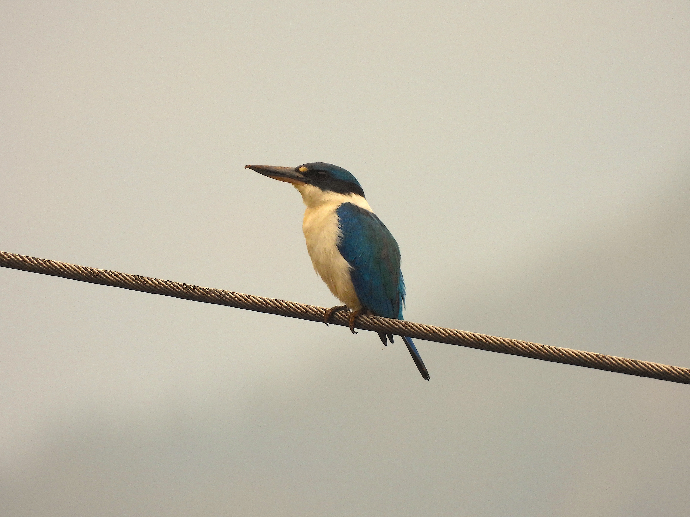
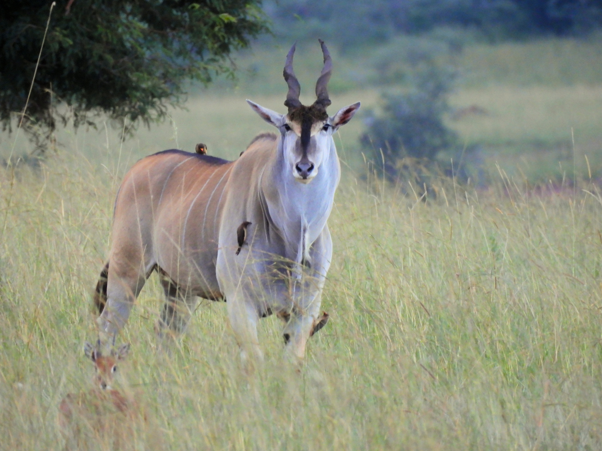
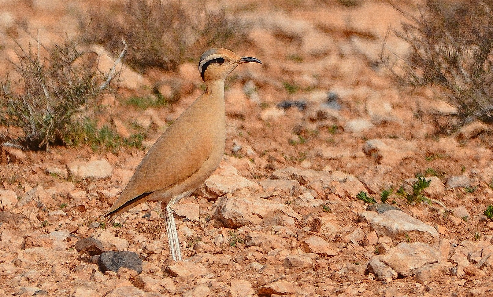
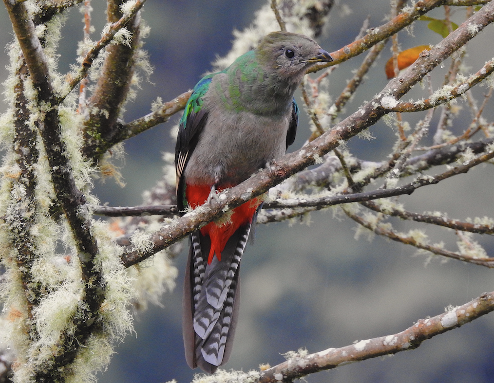
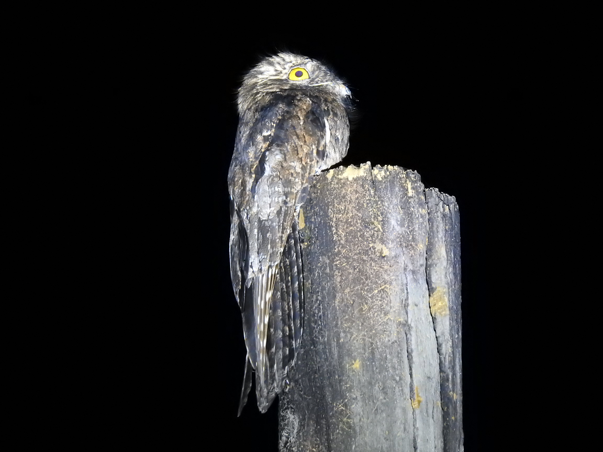
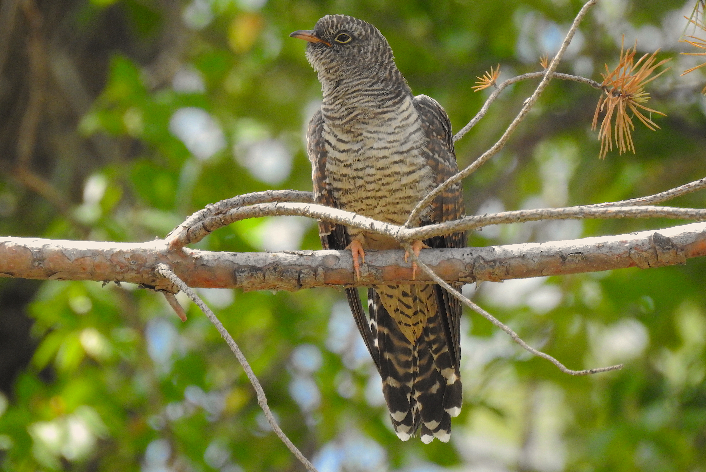
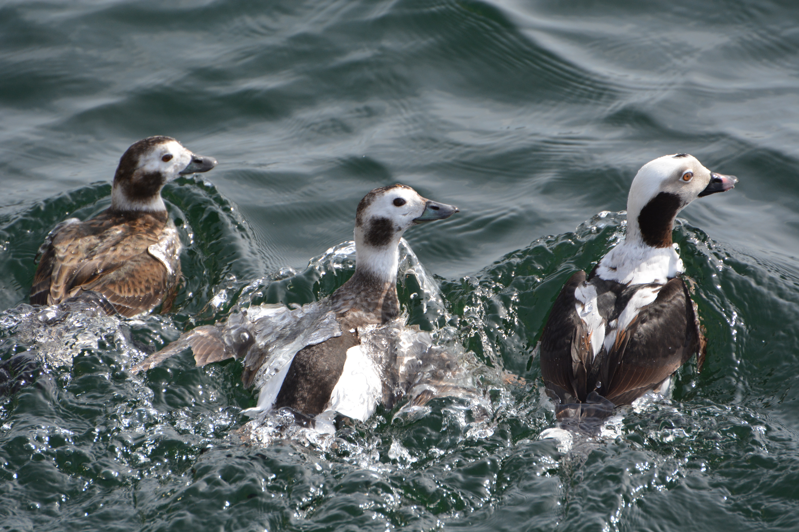
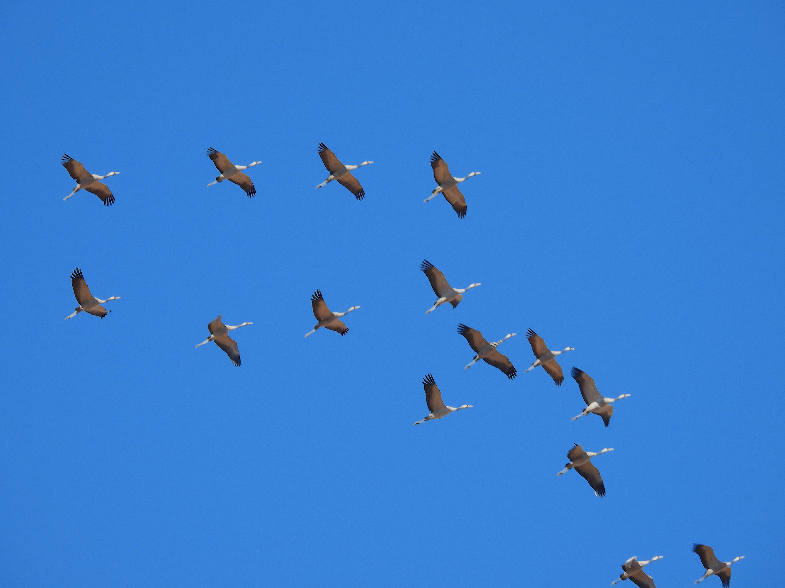

```{r setup, include=FALSE}  
knitr::opts_chunk$set(echo = TRUE)
``` 

# Machine Learning, 2026.

Last updated: `r Sys.Date()`

[Official Master's Degree in Industrial Engineering + Master's Degree in Smart Industry.](https://www.comillas.edu/en/postgraduate/master-universitario-en-ingenieria-industrial-master-en-industria-inteligente/)  
[ICAI, Universidad Pontificia Comillas.](https://www.comillas.edu/icai/)


<!-- {height=350px} {height=300px} -->
<!-- {height=350px} {height=275px} -->
<!-- {height=350px} {height=275px} -->
<!--{height=350px} {height=275px} Torcecuellos -->
<!-- {height=350px} {height=275px} --><!-- Martín pescador acollarado -->
<!-- {height=350px} {height=275px} -->
<!-- {height=300px} {height=275px} -->
<!-- {height=300px} {height=275px} -->
<!-- {height=300px} [{height=275px}](https://www.dropbox.com/scl/fi/saacenp52dwwkcg1o7etj/p900-0398-DSCN7254.MOV?rlkey=xji5hgcrxmudbqxt22c7716aa&dl=0) -->
<!-- {height=300px} {height=275px} -->
<!-- haveldas -->
<!-- {height=300px} {height=275px} -->
<!-- {height=300px} {height=275px} -->
<!-- {height=300px} {height=275px} -->
{height=300px} {height=275px}


# Sessions

## 2026-02-25 Session (3h)

+ **Midterm date:** 2026-03-26, 15:00-17:00. Location: room 201.

## 2026-02-24 Session (3h)

+ Today we finished the regularization part of 3_2 in the first hour and then in the remaining two hours we went through all of section 3_3, discussing more advanced scikit pipelines and then going quickly over nonlinear regression models.

+ Kaggle competition **public** results: [original](https://www.kaggle.com/competitions/intro-to-ml-classification-challenge/overview) and [clone](https://www.kaggle.com/competitions/intro-to-ml-classification-challenge-v-2)

## 2026-02-18 Session (3h)

+ Today we finished the discussion of Linear Regression and we started talking about regularization and feature selection methods.
+ <div style="color:red;font-weight:bold">Code for sessions 3_1 and 3_2 has been updated.</div>Make sure to git pull before resuming work. If you already made a local copy for 3_1, we suggest you make a second one from the updated version, to avoid any issues with the changes.

## 2026-02-17 Session (3h)

+ [The Kaggle competition for Assignment 1 has launched.](https://www.kaggle.com/competitions/intro-to-ml-classification-challenge/overview) 

+ Today we saw the (beutiful) *Kernel Trick* for SVM, our last classifier, and started with Linear Regression models.

## 2026-02-11 Session

+ Boosting methods. And we began the discussion of *Support Vector Machines*.

## 2026-02-10 Session

+ Today we finish the decission trees session and we start talking about ensemble and boosting methods. We have finished the bagging and random forests part. 
+ **Pandas 3.0 has arrived** (Release date: 2026-01-21). Here you will find a [Medium post with a summary of some very relevant changes](https://medium.com/python-in-plain-english/pandas-3-0-new-features-that-change-python-data-analysis-forever-e8f274aa4c6f).  
**Note:** our Docker container uses a previous version of Pandas, so we will not need/be able to use the new features in the course sessions; but we encourage you to look at the changes anyway, since Pandas ia a major component of the python Data Science stack, and the new version is a major update.
+ We will also introduce the first assignment of the course.


## 2026-02-04 Session

+ This session dealt with decission trees.  


## 2026-02-03 Session

+ Today we finished the discussion of KNN models and basic validation methods.  
+ Updated code for exercises


<!-- + Yellowbrick validation curve https://www.scikit-yb.org/en/latest/api/model_selection/validation_curve.html -->


## 2026-01-28 Session

+ Today we continued the discussion of KNN models; we are using this model to introduce many foundational ideas of Machine Learning. 

## 2026-01-27 Session

+ <h4 style="color:red; font-weight:bold;">Course schedule proposal:</h4>  
For the two weeks preceding the midterms we will have three hour sessions: 
  - Tuesdays 17th and 24th February, 15:00-18:00
  - Wednesday 18th and 25th February, 14:00-17:00

+ Today we finished the Logistic Regression and started the (very preliminary) discussion of KNN. 

## 2026-01-21 Session


We will have our first (mock) [course assignment]('./pages/MLMIIN_Student_Assignments_Handout 1.md'). Please make sure that we know your email and associated github user beforehand.

+ <h4 style="color:blue">Talk about quarto rendering.</h4>

We have been working on [2_2_Classification_Logistic_Regression](./pages/sessions/2_2_Classification_Logistic_Regression/2_2_LogisticRegression.html) and we have stopped at the paragraph with the question "What Remains to Be Done in this Model?" (before *Prediction and Model Performance Measures in Classification*).

## 2026-01-20 Session

We have finished [2_1_Classif_EDA_Preprocessing](./pages/sessions/2_1_Classif_EDA_Preprocessing/2_1_Classif_EDA_Preprocessing_local.html) notebook and we have started [2_2_Classification_Logistic_Regression](./pages/sessions/2_2_Classification_Logistic_Regression/2_2_LogisticRegression.html), discussing the signal vs noise idea behind Logistic Regression in the setting  of a one-numeric- input datasets.

+ <h4 style="color:blue;">Remember to discuss course schedule!</h4>
+ <h4 style="color:blue;">Talk about gitignore.</h4>
+ <h4 style="color:blue;">Talk about quarto rendering.</h4>


## 2026-01-14 Session

+ Remember to discuss course schedule!

## 2026-01-13 Session

+ Welcome to Machine Learning 2026!

# Docker run commands

## Mac OS

```bash
docker run -it --rm -p 8888:8888 -v "$PWD":/wd mlmiin/mlmiin:2026V01
```

### To mount the `exclude` folder

Add a second mount point like this to the command. This is needed because Docker does not follow symbolic links on Mac OS or Linux.
The command is easily adaptable to mount any other folder under Windows as well, just change the path format accordingly.


```bash
docker run -it --rm -p 8888:8888 -v "$PWD":/wd  -v "$PWD"/exclude:/wd/exclude mlmiin/mlmiin:2026V01
```

## Windows

```bash
docker run -it --rm -p 8888:8888 -v "$($PWD.Path):/wd" mlmiin/mlmiin:2026V01
```

# Links  

+ This page is at: [https://ml-mic.github.io/MLMIIN_public/](https://ml-mic.github.io/MLMIIN_public/). **Bookmark it now!**

+ [Course GitHub repository](https://github.com/ML-MIC/MLMIIN) 

+ [Student setup guide](https://ml-mic.github.io/MLMIIN_public/MLMIIN26_Student_Setup_Guide.html)

# Recommended Readings and other Resources

+ Here we include at most a brief description of each item.  See detailed [References](#references) section below.

+ The bibliography for this course is provided in a [BibTeX](https://www.bibtex.org) file called `mlmiin.bib`, which you can [download from this link](https://ml-mic.github.io/MLMIIN_public/mlmiin.bib).

::: {.callout-note icon="false}

### Let us talk about books

{width=45% fig-align="center" fig-alt="Machine Learning for Dogs"}


#### General Machine Learning

+ [@Geron2022] *Hands-On Machine Learning with Scikit-Learn, Keras & TensorFlow (3rd Edition)*. A very practical book with code examples in Python, with an approach close to the spirit of this course. The only caveat is that it uses TensorFlow/Keras for Deep Learning. And we stronlgy recommend PyTorch, so you need to learn Pytorch elsewhere (see below).

+ [@Raschka2022] *Machine Learning with PyTorch and Scikit-Learn: Develop machine learning and deep learning models with Python.* Sebastian Raschka has been writing very good books on Machine Learning for years. This is the latest iteration of his very popular "Machine Learning with Scikit-Learn" book series, and it uses PyTorch for Deep Learning, so it is a great complement to Geron's book.

+ [@serrano2021grokking] *Grokking Machine Learning*. Luis Serrano is one of the best Machine Learning educators out there, and his YouTube channel is a proof of that. We really like his conceptual approach to the subject, and this book follows closely that style.

+ [@ESLI2009] *The Elements of Statistical Learning. Data Mining, Inference and Prediction. 2nd Ed.* This is *THE BOOK* in capital letters for Machine Learning. A classic reference in the field, more theoretical and mathematically oriented than the previous ones, this is the text where many people learnt Machine Learning from when the field was much younger than today. The value of the book has not diminished with time. And to make things even better, it is kindly made available for free by the authors at [https://hastie.su.domains/ElemStatLearn](https://hastie.su.domains/ElemStatLearn).

+ [@ISLP2023] *Statistical learning. An Introduction to Statistical Learning: with Applications in Python*. A practical closer-to-the-ground version of the previous book, focusing on the implementation of the methods rather than on the theory behind them. The first edition used R for the code examples but now we have a Python edition. Also made available for free by the authors at [https://www.statlearning.com](https://www.statlearning.com)

+ [@PDSH] *Python Data Science Handbook.* This is also freely available online at [https://jakevdp.github.io/PythonDataScienceHandbook](https://jakevdp.github.io/PythonDataScienceHandbook). We are recommeding it not so much as a Machine Learning book, but as a reference for the Python data science stack (NumPy, Pandas, Matplotlib, Scikit-Learn, etc.).

+ [@pml1] *Probabilistic Machine Learning* (2022). Two volume set by K. Murphy. Visit [https://probml.github.io/pml-book/](https://probml.github.io/pml-book/). An enciclopedic, two volumes book that you can also [download for free here](https://github.com/probml/pml-book)! A great reference for the more mathematically inclined, and also a good way to help you move from classical Machine Learning to Probabilistic Machine Learning and Bayesian methods. *Note:* Use books 1 and 2, book 0 is an older version.

+ [@kuhn2013] *Applied Predictive Modeling.* Another classic reference in the field.


#### Forecasting

+ [@hyndman2025fpppy] *Forecasting: Principles and Practice, the Pythonic Way*. Hyndman's books on forecasting are the main modern reference for the subject. Originally written in R, this is the new 2025 edition using Python (in particular, the Nixtlaverse set of libraries). This text is probably set to define the pythonic approach to forecasting in the next years. And it is freely available at [https://otexts.com/fpppy/](https://otexts.com/fpppy/).

+ [@peixeiro2022time] *Time Series Forecasting in Python*. This book by Marco Peixieiro is a practical hands-on introduction to time series forecasting using Python. It used to be the basic reference for those moving from R to Python for time series forecasting, but now with Hyndman's new book it is probably in need of a second edition. Still, it is a good book to learn about forecsting in Python outside the Nixtlaverse. And I would like to add that Peixeiro's blog [*Data Science with Marco*](https://www.datasciencewithmarco.com/blog) is a great resource to learn about recent developments in time series forecasting with Python.

#### A first glimpse on Deep Learning 

+ [@glassnerVisual2021] *Deep Learning: A Visual Approach*. This is one of my favorite books to get a first understanding of many Machine Learning and Deep Learning concepts. You will not find an equation of a line of code in the entire book, but its conceptual approach and visual explanations are outstanding.

+ [Dive into deep learning](https://d2l.ai/index.html)

#### Ensemble Methods & Boosting

+ [Ensemble Methods for Machine Learning](https://www.manning.com/books/ensemble-methods-for-machine-learning) by G.Kunapuli. 

#### Hyperparameter Optimization

+ 


:::


::: {.callout-note icon="false}

### Online Resources (Web Pages, Blogs, Videos, Data Repositories)

+ [University of California at Irvine](http://archive.ics.uci.edu/ml/)
+ [Kaggle](https://www.kaggle.com/)
+ [Serrano Academy](https://www.youtube.com/@SerranoAcademy)
+ [3 blue 1 brown - Neural Networks](https://www.youtube.com/playlist?list=PLZHQObOWTQDMsr9K-fjW8Yc6l6g8b6h0s)

:::

# Session Notes (html files)

+ [1_1_Introduction](./pages/sessions/01_Setup/1_1_Introduction.html)

## Classification Sessions

+ [2_1_Classif_EDA_Preprocessing](./pages/sessions/2_1_Classif_EDA_Preprocessing/2_1_Classif_EDA_Preprocessing_local.html)
+ [2_2_LogisticRegression.html](./pages/sessions/2_2_Classification_Logistic_Regression/2_2_LogisticRegression_local.html)
+ [2_3_KNN_Validation](./pages/sessions/2_3_KNN_Validation/2_3_KNN_Validation_local.html)
+ [2_4_Decision_Trees](./pages/sessions/2_4_Decision_Trees/2_4_Decision_Trees_local.html)
+ [2_5_EnsembleMethods and Boosting](./pages/sessions/2_5_EnsembleMethods_Boosting/2_5_EnsembleMethods_Boosting_local.html)
+ [2_6_SupportVectorMachines](./pages/sessions/2_6_SupportVectorMachines/2_6_SupportVectorMachines_local.html)


## Regression Sessions

+ [3_1_LinearRegression](./pages/sessions/3_1_LinearRegression/3_1_LinearRegression_local.html))
+ [3_2_FeatureSelection_Regularization](./pages/sessions/3_2_FeatureSelection_Regularization/3_2_FeatureSelection_Regularization_local.html)
+ [3_3_Beyond_Linear_Models](./pages/sessions/3_3_Beyond_Linear_Models/3_3_Beyond_Linear_Models_local.html)
+ [3_4_NeuralNetworks](./pages/sessions//Users/fernando/code/MLMIIN/3_4_Intro_to_NN/3_4_Intro_to_NN.html))

## Forecasting Sessions

+ 4_1_Introduction_to_Forecasting
+ 4_2_Stationarity
+ 4_3_Baseline_Arima
+ 4_4_Sarima_Other_Models
+ 4_5_Forecasting_Exogenous_Prophet

## Unsupervised Learning Sessions

+ 5_1_Unsupervised_PCA
+ 5_2_Unsupervised_Clustering
+ 5_3_Density_Estimation


# References
